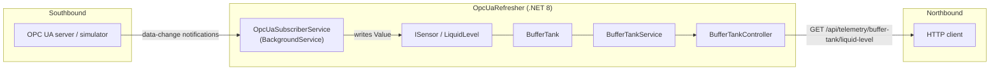

# OpcUaRefresher

A small .NET 8 service that acts as an **OPC UA client**: it connects to an OPC UA server, subscribes to a process value, keeps the latest reading in an in-memory model, and exposes it through a REST API.

It started as a refresher project to rebuild hands-on OPC UA client skills with the OPC Foundation .NET SDK, and it is a deliberately small slice of a typical field-device-to-API gateway.

> **Status:** proof of concept, tested against an OPC UA simulation server only. See [Known limitations](#known-limitations) and the [Roadmap](#roadmap).

## Architecture

In SCADA/IIoT terms, the OPC UA client is the **southbound** interface (towards field devices or servers) and the REST API is the **northbound** interface (towards consumers).



## How it works

1. **Startup** (`Program.cs`) configures the OPC UA client: application identity, PKI folder, managed session, discovery and connect, subscriptions and alarms.
2. `BufferTankService.RegisterSensors()` registers the tank's liquid-level sensor with the subscriber before the host starts.
3. `OpcUaSubscriberService` (a hosted `BackgroundService`) connects through the SDK's managed session, maps each sensor ID to an OPC UA `NodeId`, and opens a data-change subscription per sensor.
4. For every notification:
   - a **bad status code** is logged as a warning and the update is skipped;
   - a good `double` value is written to `ISensor.Value`.
5. `BufferTankController` returns the current sensor state as JSON.

## Tech stack

- .NET 8, ASP.NET Core (MVC controllers, hosted services, dependency injection)
- [`OPCFoundation.NetStandard.Opc.Ua`](https://www.nuget.org/packages/OPCFoundation.NetStandard.Opc.Ua) `2.0.0-preview.6` (a preview SDK release, so APIs may change)
- `Microsoft.Extensions.Hosting` and `Microsoft.Extensions.DependencyInjection`

## Project layout

| Path                                 | Purpose                                                     |
| ------------------------------------ | ----------------------------------------------------------- |
| `Program.cs`                         | Host setup, OPC UA client configuration, DI wiring          |
| `services/OpcUaSubscriberService.cs` | Connects to the server and monitors registered sensors      |
| `services/BufferTankService.cs`      | Registers the tank's sensors with the subscriber            |
| `Models/`                            | `ISensor`, `LiquidLevel`, `BufferTank` and DI registrations |
| `api/BufferTankController.cs`        | REST endpoint                                               |

## Getting started

**Prerequisites:** [.NET 8 SDK](https://dotnet.microsoft.com/download/dotnet/8.0) and an OPC UA server to connect to.

1. Start an OPC UA server. The defaults in the code match a local simulation server with this endpoint and node:
   <!-- TODO: confirm the simulator name (e.g. Prosys OPC UA Simulation Server) and node. -->
   - Endpoint: `opc.tcp://localhost:53530/OPCUA/SimulationServer`
   - Node: `ns=3;i=1003` (mapped to the sensor ID `liquid-level`)
2. If your server differs, change `DiscoveryUrl` in `Program.cs` and the `sensorNodeIds` map in `services/OpcUaSubscriberService.cs`.
3. Run the service:

   ```bash
   dotnet run
   ```

4. Query the API:

   ```bash
   curl http://localhost:5000/api/telemetry/buffer-tank/liquid-level
   ```

   Example response (value will vary):

   ```json
   {
     "id": "liquid-level",
     "name": "Liquid Level",
     "description": "Liquid level sensor",
     "unit": "liters",
     "value": 42.5
   }
   ```

## Current configuration

All settings are currently hard-coded in `Program.cs`.

| Setting                       | Value                              |
| ----------------------------- | ---------------------------------- |
| API address                   | `http://localhost:5000`            |
| Security mode / policy        | `None` / `None` (development only) |
| Untrusted certificates        | Auto-accepted (development only)   |
| Session timeout               | 60 s                               |
| Reconnect policy              | Max 2 retries                      |
| Publishing interval           | 1 s                                |
| Lifetime / keep-alive count   | 100 / 10                           |
| Max notifications per publish | 1000                               |

## Known limitations

This project is intentionally small. Things it does **not** do yet:

- **No quality or timestamp on the sensor.** Bad readings are skipped, but the API still returns the last good value with no staleness indicator. Before the first update arrives it returns `0`, which is indistinguishable from a real reading.
- **Only `double` values are handled.** Other numeric types (Int16/Int32/Float/Boolean) are ignored.
- **Limited recovery.** If the subscription fails, the error is logged and the subscriber stops without retrying. Reconnection is left to the SDK's managed session.
- **Shutdown is not cooperative.** The monitoring loop does not receive the host's stopping token.
- **Insecure session.** Security mode `None` and auto-accepted certificates are for local development only.
- **Hard-coded configuration.** The endpoint, node mapping and subscription settings are in code. There is a single sensor and a single server.
- **No automated tests.**

## Roadmap

**Reliability**

- [ ] Expose connection state and last-update time (health endpoint)

**Data model**

- [ ] Add `Quality` and `Timestamp` (from the OPC UA `DataValue`) to `ISensor`
- [ ] Represent "no data yet" explicitly and return it from the API
- [ ] Support Boolean, Int16/32 and Float values, with optional scaling to engineering units

**Configuration**

- [ ] Move endpoint, security settings and the tag list (ID, `NodeId`, type, scaling) to `appsettings.json`
- [ ] Support multiple tags and multiple servers

**Security**

- [ ] Signed and encrypted sessions (for example `Basic256Sha256` with `SignAndEncrypt`)
- [ ] Proper certificate trust handling and username/password authentication

**Protocol breadth**

- [ ] Introduce a driver abstraction (connect, read/subscribe, write, health)
- [ ] Add a second southbound driver (for example Modbus TCP)
- [ ] Use the SDK's alarms and conditions support that is already enabled in `Program.cs`

**Operations**

- [ ] Docker Compose setup with an OPC UA simulator
- [ ] Unit tests for status-code handling and tag mapping
- [ ] Structured logging and basic metrics (updates per second, reconnects, bad-quality count)
